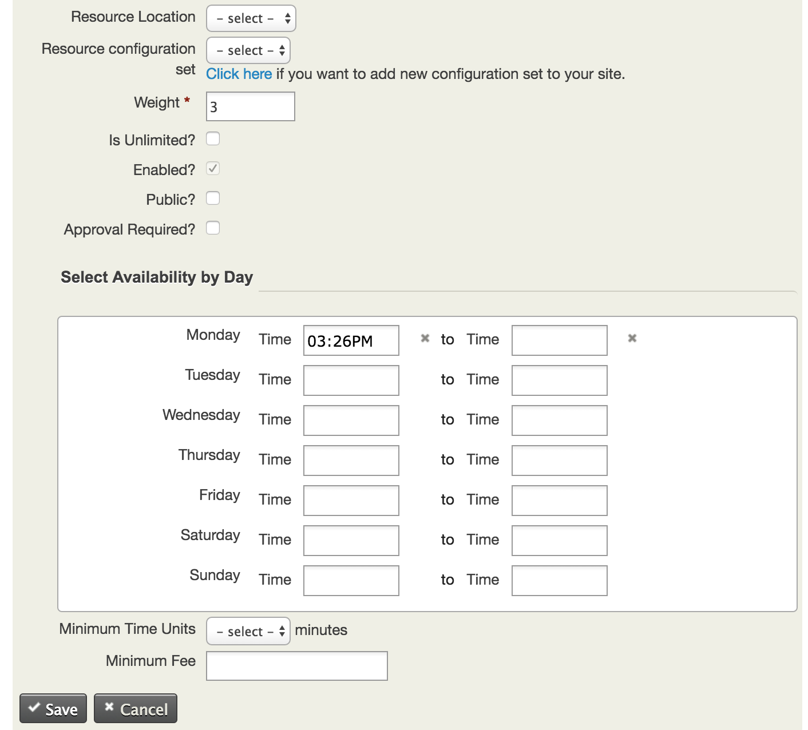

The goal of this document is to account for the changes made to the original civi4.6 branch to make future development easier.

### Change 1: Add UI elements to the resource creation form

Under the Administer > Civibooking > Manage Resources the new UI looks like the following:



The changes were made to the civibooking/templates/CRM/Admin/Form/Resource.tpl file and to the civibooking/CRM/Admin/Form/Resource.php file.

The code is fairly straightforward and is well commented.

### Change 2: Link booking form to the back-end

The follwing fields were added to the civicrm_booking_resource table:

```
is_public, tinyint(4)
is_approval_required, tinyint(4)
time_unit, int(11)
min_fee, int(11)
times_serialzed, varchar(512)
```

For ease of processing, the data for the avaliability of a particular resource is serialized in to a single string that can fit into one field in the table.

Using the bash script bin/setup.sh one is able generate tha changes necessary to both the BAO and DAO from new configurations in the schema.xml file. 

